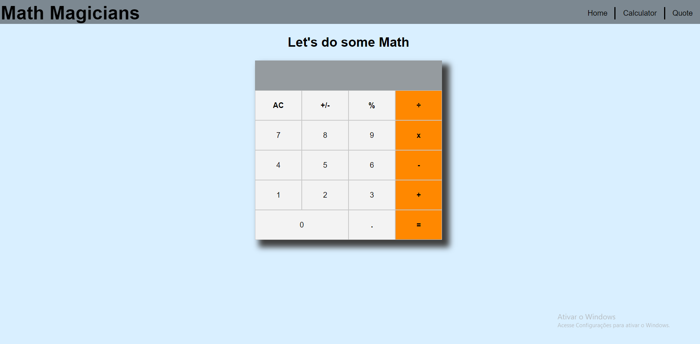

# Math Magicians - React Project

> This project is a SPA with a calculator a homepage and a page for Math quotes.



This project's goal is to teach how to create an App with React and use the concept of Single Page Apps.

## Built With

- React
- Vscode
- Git & Github
- Npm

## Live demo

- [Heroku](https://immense-lowlands-40644.herokuapp.com)
- [Netlify](https://sleepy-albattani-2ea0d0.netlify.app)

## Getting Started

To get a local copy up and running follow these simple example steps.

### Prerequisites

You will need the following:

- Github Account
- Code editor
- Node.js
### Setup

- Clone this repository to a directory you want in your computer with this command: ```git clone git@github.com:jmontanholi/react-math-magicians.git```
### Install

- Enter the directory where you copied this project and type the following in the command line: ```npm install```
### Usage

- Run this command in the command line to see the website: ```npm start```
### Run tests


## Authors

👤 **Arturo Alvarez**
- Github: [@StarSheriff2](https://github.com/StarSheriff2)
- Twitter: [@ArturoAlvarezV](https://twitter.com/ArturoAlvarezV)
- Linkedin: [Arturo Alvarez](https://www.linkedin.com/in/arturoalvarezv/)

👤 **João Vítor Montanholi Nunes**

- GitHub: [jmontanholi](https://github.com/jmontanholi)
- Twitter: [MontanholiNunes](https://twitter.com/MontanholiNunes)
- LinkedIn: [Joao vitor montanholi](https://www.linkedin.com/in/joaovitormontanholi/)

👤 **Juan Carlos Hernandez**

- GitHub: [Juan Carlos Hernandez](https://github.com/jchernandez87)
- Twitter: [Twitter](https://twitter.com/Juancar70771241)
- LinkedIn: [LinkedIn](https://www.linkedin.com/in/juan-carlos-hernandez-200a05175)
## 🤝 Contributing

Contributions, issues, and feature requests are welcome!

Feel free to check the [issues page](../../issues/).

## Show your support

Give a ⭐️ if you like this project!

## Acknowledgments

- Microverse
- Calculator logic provided by Microverse - Not my own
